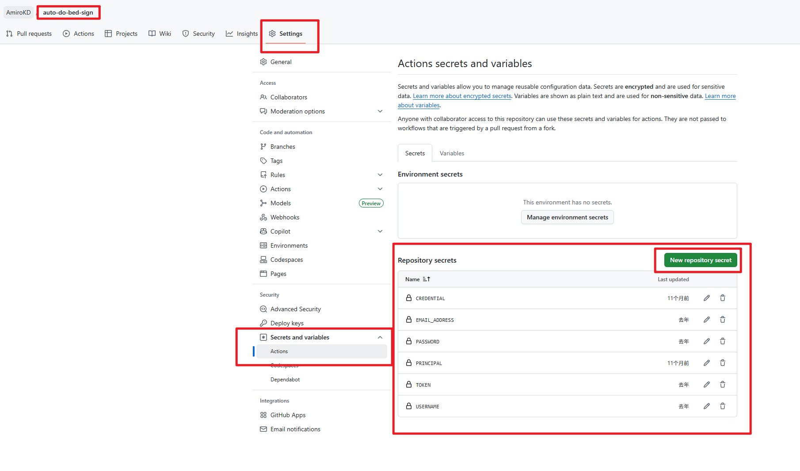
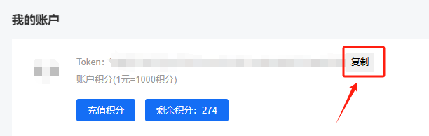
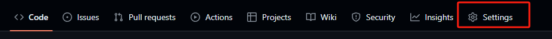
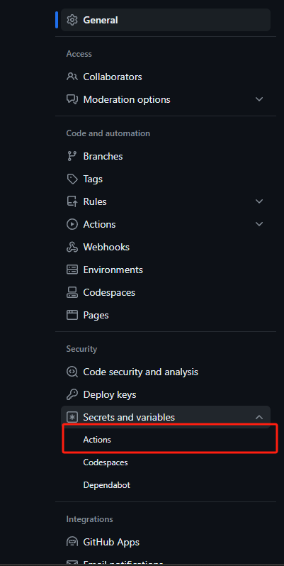
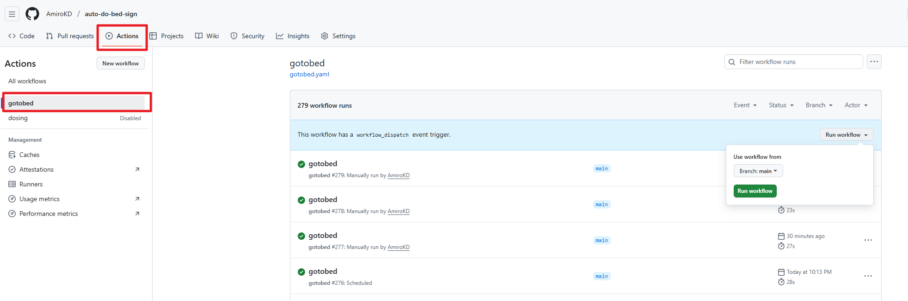
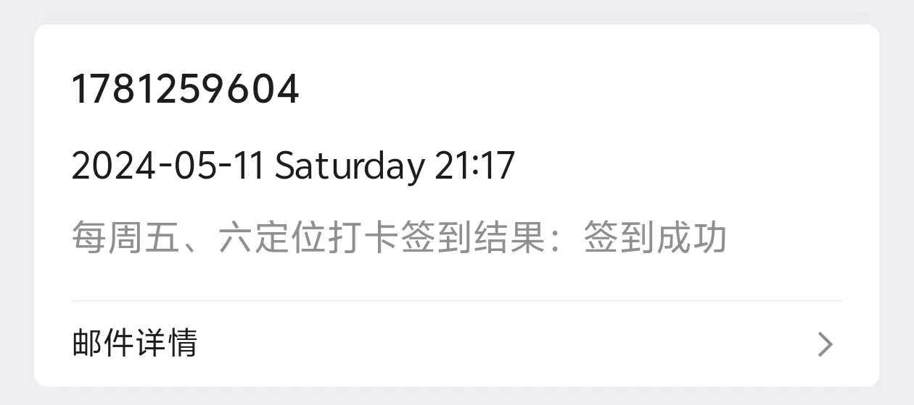
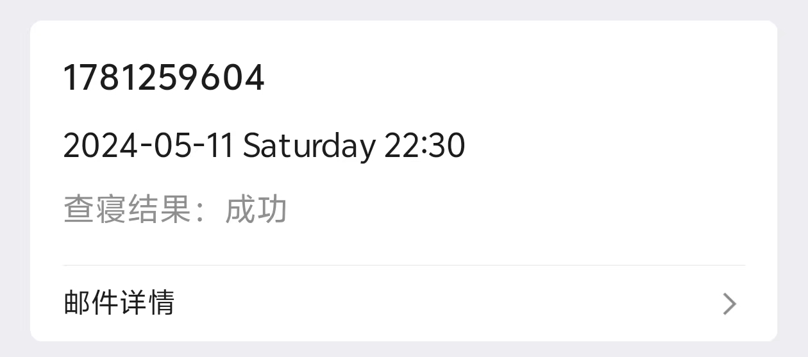

# auto-do-bed-sign

> **当前版本：v2.0** | 广州理工学院自动查寝/签到工具

### 简介

一个为广州理工学院学生打造的自动查寝签到工具，支持两种使用方式：

| 方式 | 说明 | 适合 |
|------|------|------|
| **GitHub Actions** | Fork 后配置 Secrets，全自动运行 | 个人使用、快速上手 |
| **查寝管理系统** | Docker 部署 Web 后台，管理多用户 | 多人共用、自托管服务器 |

### 核心功能

- ✅ 自动查寝签到（`gotobed`）
- ✅ 自动每日签到（`doSignIn`）
- ✅ 验证码自动识别（本地 `ddddocr`，无需第三方平台）
- ✅ 支持二次验证（密保问题/答案）
- ✅ 失败自动重试（最多 5 次，指数退避）
- ✅ 邮件通知结果
- 🆕 Web 管理后台（v2.0）：多用户管理、多时间选择、一键测试、执行日志

### v2.0 更新内容

- 新增 **查寝管理系统**，支持 Docker 部署到自有服务器
- 支持为每个用户选择 **多个打卡时间**（9:10 / 9:30 / 10:10 / 10:30）
- 新增 **测试按钮**，可立即执行查寝并查看教务系统返回结果
- 用户密码 **加密存储**（Fernet 对称加密）
- 查寝执行器改进：安全验证码计算、HTTP 超时控制、OCR 模型复用

---

## 方式一：GitHub Actions（快速上手）

### ⚙️ 变量配置

变量需要在仓库的 `Settings` -> `Secrets and variables` -> `Actions` 中配置。

### [学工平台](https://ids.gzist.edu.cn/lyuapServer/login)

首先进入学工平台，点击登录，找到账号密码登录。



### 必需的 Repository Secrets

无添加顺序要求，需将以下参数逐个添加：

```env
USERNAME      # 学工平台的账号
PASSWORD      # 学工平台的密码
EMAIL_ADDRESS # 结果发送接收邮箱地址
```

**如果出现二次验证情况**，还需要在学工系统 -> 安全中心 -> 密保 中配置以下两个变量：

```env
PRINCIPAL     # 密保问题
CREDENTIAL    # 密保答案
```



---

### 📖 使用教程

1. **Fork 仓库**
   先将本项目 Fork 到你的个人账号下。
   

2. **配置 Secrets 变量**
   在仓库的 `Settings` --> `Secrets and variables` --> `Actions` 中配置上述变量。
   
   

3. **配置定时任务**
   按照需要在 `.github/workflows` 目录下修改定时任务的触发时间。

4. **查看运行情况**
   配置成功后，在仓库的 `Actions` 选项卡中查看自动运行情况。
   

### 效果图




---

## 方式二：查寝管理系统（自托管）

> 部署到自己的服务器，通过 Web 后台管理多个用户的查寝任务。

### 功能亮点

- 🖥️ Web 管理后台，支持多用户增删改查
- ⏰ 每个用户可选择多个打卡时间
- 🔐 用户密码加密存储
- 🧪 一键测试按钮，立即验证查寝是否正常
- 📋 执行日志查看，按用户筛选
- 📧 邮件通知（可选）
- 🐳 Docker 一键部署

### 快速开始

```bash
# 克隆项目
git clone <repo-url>
cd auto-do-bed-sign

# 生成加密密钥
python -c "from cryptography.fernet import Fernet; print(Fernet.generate_key().decode())"

# 配置环境变量
cp gotobed-system/.env.example .env
# 编辑 .env 填入管理员密码和加密密钥

# Docker 启动
cd gotobed-system
docker-compose up -d --build

# 访问 http://your-server:5000
```

> 📖 完整部署文档请参考 [gotobed-system/README.md](gotobed-system/README.md)

---

## ⚠️ 注意事项

- 如果使用 QQ 邮箱接收结果，第一次请检查是否被误判为垃圾邮件
- 两种方式**可以同时使用**，互不影响
- GitHub Actions 方式支持签到（doSignIn）+ 查寝（gotobed）
- 查寝管理系统仅支持查寝（gotobed）

## 📁 项目结构

```
auto-do-bed-sign/
├── gzlg助手/                  # 原始脚本（GitHub Actions 用）
│   ├── goToBed.py             # 查寝脚本
│   ├── dowork.py              # 签到脚本
│   ├── emailSender.py         # 邮件发送
│   └── g5116.js               # 密码加密 JS
├── gotobed-system/            # 查寝管理系统（v2.0 新增）
│   └── README.md              # 详细部署文档
└── .github/workflows/         # GitHub Actions 配置
    ├── gotobed.yaml           # 查寝定时任务
    └── dowork.yaml            # 签到定时任务
```
